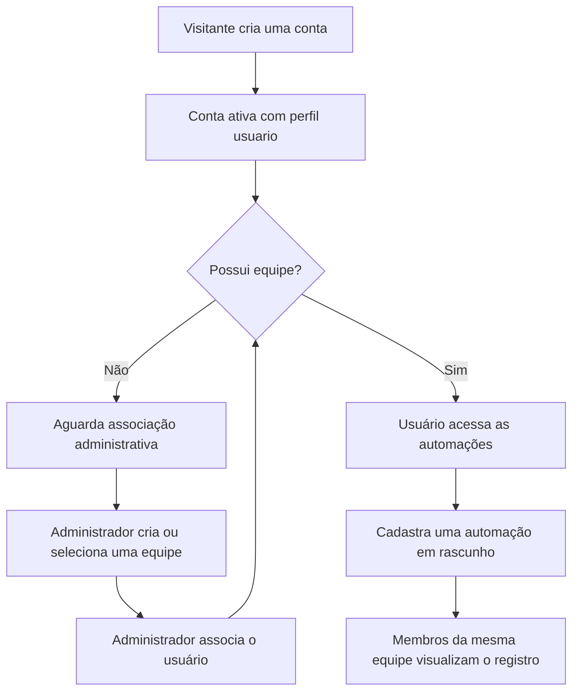
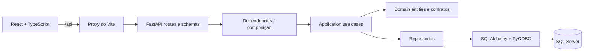

# FlowOps

Plataforma full-stack para cadastrar e organizar automações compartilhadas entre
usuários da mesma equipe.

O FlowOps foi criado como um projeto de portfólio para praticar desenvolvimento
web moderno, integração entre frontend e backend, autenticação, autorização,
persistência no SQL Server, migrations e testes automatizados.

> **Status:** MVP funcional para execução local. Nesta versão, o sistema
> organiza o catálogo de automações; ele ainda não executa processos externos.

## Sumário

- [Objetivo](#objetivo)
- [Funcionalidades](#funcionalidades)
- [Fluxo do MVP](#fluxo-do-mvp)
- [Tecnologias](#tecnologias)
- [Arquitetura](#arquitetura)
- [Estrutura do projeto](#estrutura-do-projeto)
- [Pré-requisitos](#pré-requisitos)
- [Configuração do ambiente](#configuração-do-ambiente)
- [Preparação do SQL Server](#preparação-do-sql-server)
- [Execução](#execução)
- [Primeiro administrador](#primeiro-administrador)
- [Endpoints principais](#endpoints-principais)
- [Como demonstrar o projeto](#como-demonstrar-o-projeto)
- [Testes](#testes)
- [Segurança](#segurança)
- [Limitações do MVP](#limitações-do-mvp)
- [Roadmap](#roadmap)
- [Aprendizados demonstrados](#aprendizados-demonstrados)

## Objetivo

O projeto representa uma aplicação interna na qual uma empresa pode organizar
as automações conhecidas por suas equipes. Cada usuário pertence a, no máximo,
uma equipe, e as automações ficam visíveis para todos os integrantes desse mesmo
grupo.

O escopo foi mantido propositalmente simples para demonstrar um fluxo completo:

```text
Cadastro → Login → Associação à equipe → Cadastro de automação →
Compartilhamento com a equipe
```

## Funcionalidades

### Área pública

- Página inicial responsiva.
- Cadastro com nome, e-mail, senha e confirmação da senha.
- Login com e-mail e senha.
- Validações de formulário e mensagens de erro acessíveis.

### Autenticação e conta

- Senhas protegidas com Argon2id.
- Autenticação com access token JWT.
- Restauração da sessão no frontend.
- Consulta do usuário atual no banco a cada validação da sessão.
- Bloqueio imediato de usuários inativos.
- Página de dados da conta.

### Equipes e automações

- Criação e listagem de equipes por administradores.
- Associação administrativa entre usuário e equipe.
- Estado de onboarding para contas que ainda aguardam uma equipe.
- Cadastro e listagem paginada de automações.
- Automações criadas inicialmente como `rascunho`.
- Nome de automação único dentro da mesma equipe.
- Compartilhamento entre membros da equipe sem vazamento entre equipes.

### Administração

- Dashboard com indicadores reais de usuários.
- Listagem paginada de usuários.
- Alteração de perfil entre `usuario` e `administrador`.
- Ativação e desativação de contas.
- Proteções contra auto-rebaixamento e autodesativação do administrador.
- Modal reutilizável para confirmação de ações.

## Fluxo do MVP

Uma conta pública sempre é criada com o perfil `usuario` e sem equipe. Isso
impede que o visitante escolha privilégios ou entre por conta própria em uma
equipe existente.



O vínculo manual foi adotado para manter o MVP simples e seguro. Convites e
administração por empresa estão documentados no roadmap.

## Tecnologias

### Frontend

- React 19.
- TypeScript.
- Vite.
- React Router.
- Tailwind CSS 4.
- Lucide React.

### Backend

- Python 3.11+.
- FastAPI.
- Pydantic e pydantic-settings.
- SQLAlchemy 2.
- Alembic.
- PyODBC.
- pwdlib com Argon2id.
- PyJWT.
- Pytest e HTTPX.

### Banco de dados

- SQL Server.
- Microsoft ODBC Driver 18 for SQL Server.
- Schemas `auth` e `operacao`.

## Arquitetura

O backend separa regras de negócio, casos de uso, HTTP e infraestrutura. O
frontend acessa a API pelo proxy do Vite durante o desenvolvimento.



Responsabilidades principais:

- `api`: rotas HTTP, schemas e tradução de erros para respostas da API.
- `application`: coordenação dos casos de uso e serviços técnicos.
- `domain`: entidades, enums, exceções e contratos de repositórios.
- `infrastructure`: SQLAlchemy, SQL Server, Argon2id e JWT.
- `core`: configurações compartilhadas da aplicação.
- `frontend/src/services`: comunicação HTTP com o backend.
- `frontend/src/contexts`: estado da sessão autenticada.
- `frontend/src/pages` e `components`: interface e interação com o usuário.

### Isolamento por equipe

O frontend não escolhe `equipe_id`, criador ou status ao cadastrar uma
automação. O backend recarrega o usuário autenticado, resolve sua equipe no
banco e utiliza esse contexto nas consultas e gravações.

```text
Token → Usuário atual no banco → Equipe ativa → Dados da equipe
```

Essa regra evita que um cliente altere o payload para acessar dados de outra
equipe.

## Estrutura do projeto

```text
FlowOps/
├── backend/
│   ├── .scripts/database/       # Bootstrap e validação do SQL Server
│   ├── app/
│   │   ├── api/                 # Rotas, schemas e dependências
│   │   ├── application/         # Casos de uso e serviços
│   │   ├── core/                # Configurações
│   │   ├── domain/              # Regras e contratos
│   │   └── infrastructure/      # Banco, repositórios e segurança
│   ├── migrations/              # Evolução do banco com Alembic
│   └── tests/                   # Testes unitários e de integração
├── frontend/
│   ├── src/
│   │   ├── components/          # Componentes reutilizáveis
│   │   ├── contexts/            # Sessão autenticada
│   │   ├── pages/               # Páginas da aplicação
│   │   ├── services/            # Clientes HTTP
│   │   └── types/               # Contratos TypeScript
│   └── vite.config.ts           # Vite, Tailwind e proxy da API
└── README.md
```

## Pré-requisitos

O fluxo documentado abaixo utiliza Windows e PowerShell.

- Git.
- Python 3.11 ou superior.
- Node.js e npm.
- SQL Server 2022 ou superior.
- SQL Server em modo de autenticação mista.
- Microsoft ODBC Driver 18 for SQL Server.
- `sqlcmd` disponível no terminal.
- Conta Windows com permissão para criar o banco e executar migrations no
  ambiente local.

## Configuração do ambiente

### 1. Clone

```powershell
git clone https://github.com/RaphaelPavaneli/FlowOps.git
cd FlowOps
```

### 2. Backend

```powershell
cd backend
python -m venv .venv
.\.venv\Scripts\Activate.ps1
python -m pip install -e ".[dev]"
Copy-Item .env.example .env
```

Gere uma chave JWT aleatória:

```powershell
python -c "import secrets; print(secrets.token_hex(32))"
```

Atualize `backend/.env`:

```env
DB_SERVER=localhost
DB_PORT=1433
DB_NAME=DB_FLOWOPS
DB_USER=flowops_app
DB_PASSWORD=defina-uma-senha-local-segura
DB_TRUST_SERVER_CERTIFICATE=true
JWT_SECRET_KEY=cole-a-chave-aleatoria-gerada
```

Observações:

- A senha de `DB_PASSWORD` deve ser a mesma informada ao script de preparação
  do banco.
- `DB_TRUST_SERVER_CERTIFICATE=true` é adequado apenas para desenvolvimento
  local com certificado não confiável.
- O `.env` não deve ser versionado.
- `JWT_SECRET_KEY` precisa possuir pelo menos 32 caracteres e não pode manter o
  valor de exemplo.

## Preparação do SQL Server

> **Ação persistente:** o comando abaixo cria ou atualiza objetos no SQL Server
> local.

Com o ambiente virtual ativo e dentro de `backend`:

```powershell
.\.scripts\database\setup_database.ps1
```

O script utiliza a conta Windows para:

1. Criar `DB_FLOWOPS`, se necessário.
2. Aplicar `python -m alembic upgrade head`.
3. Criar o login SQL `flowops_app`, se necessário.
4. Conceder permissões de dados nos schemas `auth` e `operacao`.
5. Validar tabelas, índices, versão Alembic e permissões.

Ele solicitará a senha de `flowops_app` sem gravá-la no repositório. Mais
detalhes estão em
[`backend/.scripts/database/README.md`](backend/.scripts/database/README.md).

As migrations atuais criam:

- `auth.usuarios`.
- `auth.equipes` e o vínculo opcional do usuário.
- `operacao.automacoes`.

Alembic é a fonte de verdade para a estrutura das tabelas.

## Execução

Use dois terminais.

### Terminal 1 — API

```powershell
cd backend
.\.venv\Scripts\Activate.ps1
python -m uvicorn app.main:app --reload
```

Endereços:

- API: `http://127.0.0.1:8000`
- Swagger UI: `http://127.0.0.1:8000/docs`
- Health check: `http://127.0.0.1:8000/api/v1/health`

### Terminal 2 — Interface

```powershell
cd frontend
npm.cmd install
npm.cmd run dev
```

Acesse `http://localhost:5173`.

Durante o desenvolvimento, o Vite encaminha requisições iniciadas com `/api`
para `http://127.0.0.1:8000`.

## Primeiro administrador

O cadastro público sempre cria um usuário comum. Isso impede que um visitante
escolha privilégios administrativos.

Para preparar uma demonstração local:

1. Cadastre a conta pela interface em `http://localhost:5173/cadastro`.
2. Promova essa conta diretamente no SQL Server local.

> **Ação persistente e somente para bootstrap local:** revise o e-mail antes de
> executar.

```sql
USE [DB_FLOWOPS];

UPDATE auth.usuarios
SET perfil_acesso = 'administrador',
    atualizado_em = SYSUTCDATETIME()
WHERE email = N'admin@exemplo.com';
```

Saia e entre novamente para atualizar a interface. Depois disso, alterações de
perfil podem ser feitas pela gestão de usuários, sem novos comandos SQL.

Em uma aplicação de produção, esse bootstrap deve ser substituído por um
processo operacional auditável.

## Endpoints principais

Todos os endpoints utilizam o prefixo `/api/v1`.

| Método | Endpoint | Acesso | Finalidade |
|---|---|---|---|
| `GET` | `/health` | Público | Verificar a disponibilidade da API |
| `POST` | `/autenticacao/cadastro` | Público | Criar um usuário comum |
| `POST` | `/autenticacao/login` | Público | Emitir um access token JWT |
| `GET` | `/autenticacao/usuario-atual` | Autenticado | Obter a conta atual |
| `GET` | `/automacoes` | Equipe ativa | Listar automações da equipe |
| `POST` | `/automacoes` | Equipe ativa | Cadastrar uma automação em rascunho |
| `GET` | `/usuarios` | Administrador | Listar usuários |
| `PATCH` | `/usuarios/{id}/perfil` | Administrador | Alterar perfil |
| `PATCH` | `/usuarios/{id}/status` | Administrador | Ativar ou desativar conta |
| `GET` | `/equipes` | Administrador | Listar equipes |
| `POST` | `/equipes` | Administrador | Criar equipe |
| `PUT` | `/equipes/{equipe_id}/membros/{usuario_id}` | Administrador | Associar usuário |
| `GET` | `/dashboard/resumo-administrativo` | Administrador | Consultar indicadores reais |

Os schemas completos e exemplos interativos ficam disponíveis no Swagger UI.

## Como demonstrar o projeto

Um roteiro curto para apresentar o MVP:

1. Abra a página inicial e mostre o objetivo do produto.
2. Cadastre um usuário comum.
3. Entre com a conta e mostre o estado `Equipe pendente`.
4. Entre como administrador.
5. Crie uma equipe e associe o novo usuário.
6. Mostre a gestão de perfil e status da conta.
7. Volte ao usuário comum e atualize a situação.
8. Cadastre uma automação.
9. Entre com outro membro da mesma equipe e mostre o compartilhamento.
10. Explique que outra equipe não recebe esse registro.

Esse fluxo demonstra frontend, API, autenticação, autorização, banco relacional
e isolamento de dados.

## Testes

### Backend

Dentro de `backend`:

```powershell
.\.venv\Scripts\python.exe -m pytest
```

A suíte cobre, entre outros cenários:

- Cadastro seguro e e-mail duplicado.
- Login, JWT e usuário atual.
- Autorização administrativa.
- Proteção contra autodesativação e auto-rebaixamento.
- Criação e associação de equipes.
- Usuário sem equipe e equipe inativa.
- Isolamento das automações entre equipes.
- Nome duplicado e paginação.

Os testes comuns utilizam SQLite em memória com dependências substituídas. Eles
validam as regras e a integração HTTP, mas não comprovam o comportamento
específico do SQL Server, ODBC ou das migrations.

### Frontend

```powershell
cd frontend
npm.cmd run build
```

Esse comando executa a verificação TypeScript e gera o bundle de produção com
Vite.

## Segurança

Práticas aplicadas no MVP:

- Hash de senha com Argon2id.
- JWT assinado com algoritmo fixo, emissor, audiência e expiração.
- Chave JWT obrigatória com tamanho mínimo.
- Resposta genérica para falha de login.
- Verificação de hash fictício para e-mails inexistentes.
- Revalidação do usuário ativo no banco.
- Cadastro público sem escolha de perfil ou equipe.
- Regras administrativas também protegidas no backend.
- Separação das automações pelo usuário autenticado e sua equipe atual.
- Segredos mantidos fora do Git por meio de `.env`.
- Bootstrap que concede ao login da aplicação somente permissões de dados nos
  schemas necessários, sem conceder novos papéis administrativos.

## Limitações do MVP

- A associação do usuário à equipe é manual e administrativa.
- O perfil `administrador` é global dentro desta versão do projeto.
- O sistema registra automações, mas não executa integrações externas.
- Status de automação ainda não possui fluxo de alteração na interface.
- Não existe recuperação de senha ou verificação de e-mail.
- Não há envio de convites.
- Não há uma entidade separada para empresa ou organização.
- Não há deploy público documentado.
- Testes automatizados não substituem a validação manual no SQL Server e no
  navegador.

Essas limitações mantêm o projeto compatível com seu objetivo de portfólio e
não representam funcionalidades concluídas.

## Roadmap

Melhorias possíveis depois da entrega do MVP:

- Convites seguros para associação automática a equipes.
- Entidade Empresa com administradores limitados ao próprio contexto.
- Edição, ativação, pausa e arquivamento de automações.
- Histórico de execuções e notificações.
- Recuperação de senha e verificação de e-mail.
- Testes de componentes no frontend.
- Pipeline de integração contínua.
- Containers para simplificar o ambiente local.
- Deploy de demonstração.
- Logs estruturados e observabilidade.

## Aprendizados demonstrados

O FlowOps reúne práticas relevantes para desenvolvimento full-stack:

- Componentização e gerenciamento de estado com React.
- Contratos e segurança de tipos com TypeScript.
- Rotas públicas, autenticadas e administrativas.
- APIs REST com FastAPI e Pydantic.
- Separação entre domínio, aplicação e infraestrutura.
- Repository Pattern e composição de dependências.
- SQLAlchemy, SQL Server e evolução de schema com Alembic.
- Autenticação, autorização e proteção de credenciais.
- Modelagem de relacionamentos e isolamento por equipe.
- Testes automatizados de regras e endpoints.
- Tratamento consistente de erros e estados de interface.
- Git, branches, commits e Pull Requests durante a evolução do projeto.

---

Projeto pessoal desenvolvido para estudo, prática e evolução profissional em
desenvolvimento full-stack.
